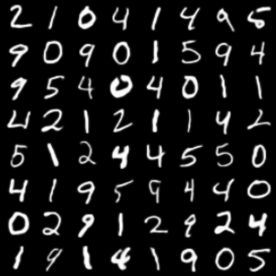
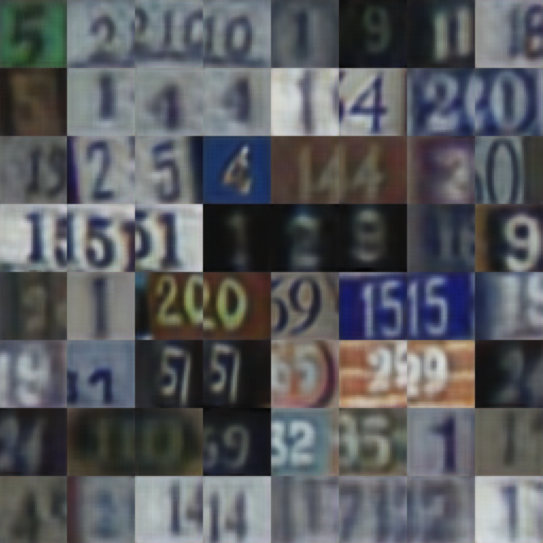
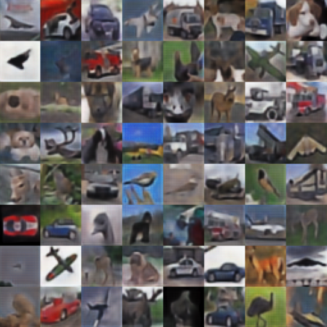

# Conditional Variational Capsule Network for Open Set Recognition

[](https://arxiv.org/abs/2104.09159)
[](http://iccv2021.thecvf.com/home)


This repository hosts the official code related to *"Conditional Variational Capsule Network for Open Set Recognition", Y. Guo, G. Camporese, W. Yang, A. Sperduti, L. Ballan, arXiv:2104.09159, 2021*. [[Download](https://arxiv.org/abs/2104.09159)]


```bash
If you use the code of this repo and you find this project useful, 
please consider to give a star ⭐!
```

```bibtex
@article{Guo2021ConditionalVC,
  title={Conditional Variational Capsule Network for Open Set Recognition},
  author={Yunrui Guo and Guglielmo Camporese and Wenjing Yang and Alessandro Sperduti and Lamberto Ballan},
  journal={2021 IEEE/CVF International Conference on Computer Vision (ICCV)},
  year={2021},
  pages={103-111}
}
```

# Updates
- **[2021/04/09]** - The code is online,
- **[2021/07/22]** - The paper has been accepted to ICCV-2021!


# Install

Once you have cloned the repo, all the commands below should be runned inside the main project folder `cvaecaposr`:

 ```sh
 # Clone the repo
 $ git clone https://github.com/guglielmocamporese/cvaecaposr.git
 
 # Go to the project directory
 $ cd cvaecaposr
 ```

To run the code you need to have conda installed (version >= 4.9.2). 

Furthermore, all the requirements for running the code are specified in the `environment.yaml` file and can be installed with:

```sh
# Install the conda env
$ conda env create --file environment.yaml

# Activate the conda env
$ conda activate cvaecaposr
```

# Dataset Splits
You can find the dataset splits for all the datasets we have used (i.e. for `MNIST`, `SVHN`, `CIFAR10`, `CIFAR+10`, `CIFAR+50` and `TinyImageNet`) in the `splits.py` file.

When you run the code the datasets will be automatically downloaded in the `./data` folder and the split number selected is determined by the `--split_num` argument specified when you run the `main.py` file (more on how to run the code in the **Experiment** section below).


# Model Checkpoints

You can download the model checkpoints using the `download_checkpoints.sh` script in the `scripts` folder by running:

```sh
# Extend script permissions
$ chmod +x ./scripts/download_checkpoints.sh

# Download model checkpoints
$ ./scripts/download_checkpoints.sh
```

After the download you will find the model checkpoints in the `./checkpoints` folder:
- `./checkpoints/mnist.ckpt`
- `./checkpoints/svhn.ckpt`
- `./checkpoints/cifar10.ckpt`
- `./checkpoints/cifar+10.ckpt`
- `./checkpoints/cifar+50.ckpt`
- `./checkpoints/tiny_imagenet.ckpt`

The size of each checkpoint file is between ~370 MB and ~670 MB.


# Experiments
For all the experiments we have used a GeForce RTX 2080 Ti (11GB of memory) GPU. 

For the training you will need ~7300 MiB of GPU memory whereas for test ~5000 MiB of GPU memory.

## Train

The **CVAECapOSR** model can be trained using the `main.py` program. Here we reported an example of a training script for the `mnist` experiment:

```sh
# Train
$ python main.py \
      --data_base_path "./data" \
      --dataset "mnist" \
      --val_ratio 0.2 \
      --seed 1234 \
      --batch_size 32 \
      --split_num 0 \
      --z_dim 128 \
      --lr 5e-5 \
      --t_mu_shift 10.0 \
      --t_var_scale 0.1 \
      --alpha 1.0 \
      --beta 0.01 \
      --margin 10.0 \
      --in_dim_caps 16 \
      --out_dim_caps 32 \
      --checkpoint "" \
      --epochs 100 \
      --mode "train"
```

For simplicity we provide all the training scripts for the different datasets in the `scripts` folder. Specifically, you will find: 
- `train_mnist.sh`
- `train_svhn.sh`
- `train_cifar10.sh`
- `train_cifar+10.sh`
- `train_cifar+50.sh`
- `train_tinyimagenet.sh`

that you can run as follows:

```sh
# Extend script permissions
$ chmod +x ./scripts/train_{dataset}.sh # where you have to set a dataset name

# Run training
$ ./scripts/train_{dataset}.sh # where you have to set a dataset name
```

All the temporary files of the training stage (model checkpoints, tensorboard metrics, ...) are created at `./tmp/{dataset}/version_{version_number}/` where the `dataset` is specified in the `train_{dataset}.sh` script and `version_number` is an integer number that is tracked and computed automatically in order to not override training logs (each training will create unique files in different folders, with different versions).

## Test

The **CVAECapOSR** model can be tested using the `main.py` program. Here we reported an example of a test script for the `mnist` experiment:

```sh
# Test
$ python main.py \
      --data_base_path "./data" \
      --dataset "mnist" \
      --val_ratio 0.2 \
      --seed 1234 \
      --batch_size 32 \
      --split_num 0 \
      --z_dim 128 \
      --lr 5e-5 \
      --t_mu_shift 10.0 \
      --t_var_scale 0.1 \
      --alpha 1.0 \
      --beta 0.01 \
      --margin 10.0 \
      --in_dim_caps 16 \
      --out_dim_caps 32 \
      --checkpoint "checkpoints/mnist.ckpt" \
      --mode "test"
```

For simplicity we provide all the test scripts for the different datasets in the `scripts` folder. Specifically, you will find: 
- `test_mnist.sh`
- `test_svhn.sh`
- `test_cifar10.sh`
- `test_cifar+10.sh`
- `test_cifar+50.sh`
- `test_tinyimagenet.sh`

that you can run as follows:

```sh
# Extend script permissions
$ chmod +x ./scripts/test_{dataset}.sh # where you have to set a dataset name

# Run training
$ ./scripts/test_{dataset}.sh # where you have to set a dataset name
```

# Model Reconstruction
Here we reported the reconstruction of some test samples of the model after training.

| **MNIST** | 
| --------- |
|  |


|**SVHN** | 
| ------- |
|  |

|**CIFAR10** |
| ---------- |
|  | 

|**TinyImageNet** |
| --------- |
|  |
